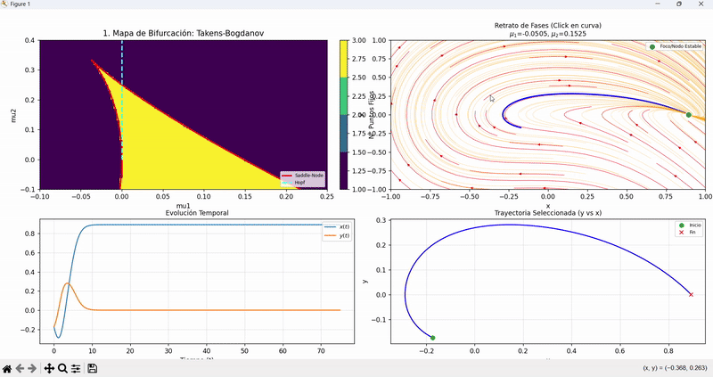
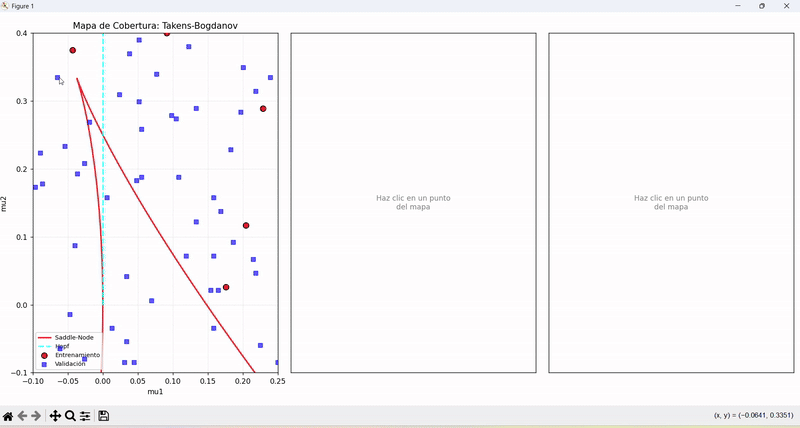

# SINDy y Descubrimiento de Bifurcaciones


Pipeline modular y de alto rendimiento para descubrir, mediante **SINDy** (*Sparse Identification of Nonlinear Dynamics*), las ecuaciones diferenciales que gobiernan sistemas no lineales con dependencia paramétrica.

El foco del proyecto es el **descubrimiento data-driven de bifurcaciones de codimensión 2**, con herramientas para: generación masiva de datos sintéticos, entrenamiento por ensamble de modelos SINDy, validación cruzada por simulación, búsqueda de hiperparámetros y exploración interactiva del espacio de parámetros.

## Tabla de contenidos

- [Características](#caracter%C3%ADsticas)
- [Sistemas implementados](#sistemas-implementados)
- [Arquitectura del repositorio](#arquitectura-del-repositorio)
- [Instalación](#instalaci%C3%B3n)
- [Configuración (Google Drive)](#configuraci%C3%B3n-google-drive)
- [Flujo de trabajo](#flujo-de-trabajo)
- [Módulos del código](#m%C3%B3dulos-del-c%C3%B3digo)
- [Formato de datos](#formato-de-datos)
- [Cómo extender](#c%C3%B3mo-extender)
- [Notas de rendimiento](#notas-de-rendimiento)

---

## Características

- **Descubrimiento paramétrico de ecuaciones**. SINDy clásico asume coeficientes constantes; este pipeline trata los parámetros como variables adicionales del estado, lo que permite a la regresión rala recuperar la dependencia funcional entre la dinámica y los parámetros — incluyendo, en principio, las **curvas de bifurcación**.
- **Pipeline cloud-native**. Las trayectorias se generan localmente y se suben a Google Drive en streaming, permitiendo experimentos pesados sin saturar disco local.
- **Numba JIT end-to-end**. Integradores RK4, campos vectoriales y bibliotecas polinómicas compilados con `@jit(nopython=True, cache=True)`.
- **Paralelismo en dos niveles**. `ProcessPoolExecutor` para CPU (integración) + `ThreadPoolExecutor` para I/O (subida a Drive y escritura HDF5).
- **Streaming HDF5**. Datos en `float32` con compresión `gzip` y chunking por trayectoria para acceso eficiente.
- **Visualización interactiva**. Visores del retrato de fases, mapa de bifurcaciones y comparador *Ground Truth* vs SINDy.
- **Análisis avanzado**. Búsqueda de hiperparámetros (Grid Search), refinamiento (Hill Climbing), barridos temporales con checkpoints, sweeps estadísticos, detección rigurosa de la curva homoclínica.
- **Agnóstico a la dimensión**. La máquina numérica soporta sistemas con $N$ variables de estado y $M$ parámetros sin cambios al núcleo.

## Sistemas implementados

El sistema patrón es la forma normal extendida de **Takens-Bogdanov**:

$$
\begin{aligned}
\dot{x} &= y \\
\dot{y} &= -\mu_1 - \mu_2 x + x^2 - x^3 - (x^2 + x)\,y
\end{aligned}
$$

con $(\mu_1, \mu_2)$ como parámetros de bifurcación. Este sistema exhibe cinco zonas dinámicas distintas separadas por curvas de **Saddle-Node**, **Hopf** y **Homoclínica**.

| Sistema | Archivo | Descripción |
|---|---|---|
| **Takens-Bogdanov extendido** | `systems/takens_bogdanov.py` | Forma normal con términos de orden superior, codimensión 2. Caso de estudio principal. |
| **TB cuadrático** | `systems/cuadratic_takens_bogdanov.py` | Variante didáctica más simple. |
| **TB cúbico simétrico** | `systems/cubic_symmetric_takens_bogdanov.py` | Variante con simetría $\mathbb{Z}_2$. |
| **Siringe (modelo masa 1 modificado)** | `systems/syrinx.py` | Modelo biomecánico dimensional para vocalización aviar. Parámetros de control: presión subglótica $P_\text{sub}$ y rigidez lineal $\kappa_1$. |

El modelo de la siringe es:

$$
m\,\ddot{x} + (\gamma_1 + \gamma_2 \dot{x}^2)\,\dot{x} + (\kappa_1 + \kappa_2 x^2)\,x + c\,x^2 \dot{x} = f_0 + a_\text{lab}\,P_\text{sub}\,\frac{\Delta a + 2\tau\dot{x}}{a_{01} + x + \tau\dot{x}}
$$

Tiene 12 parámetros físicos (mecánicos, geométricos y aerodinámicos), de los cuales $(\kappa_1, P_\text{sub})$ se barren mientras los otros 10 quedan fijos en `experiments/syrinx/config.py`.

## Arquitectura del repositorio

El repo está organizado **por rol** (qué hace cada cosa), no por sistema, para evitar duplicación y dejar claro qué es código y qué es dato:

```text
sindy-bifurcation-discovery/
├── core/                       # Máquina numérica (agnóstica al sistema)
├── systems/                    # Definiciones de ODE
├── experiments/                # Drivers de experimento por sistema
│   ├── takens_bogdanov/
│   └── syrinx/
├── data/                       # Artefactos generados (gitignored)
├── results/                    # Resultados curados de análisis (gitignored)
├── config/                     # Credenciales de Drive (gitignored)
├── images/                     # GIFs del README
├── readme.md
├── pyproject.toml / uv.lock / requirements.txt
└── .env / .gitignore / .python-version
```

### Por qué esta estructura

- **`systems/` vs `experiments/`** — `systems/<x>.py` define las ODE; `experiments/<x>/` contiene los scripts que las usan. La separación evita el conflicto entre carpetas de scripts y módulos del mismo nombre.
- **`data/` vs `results/`** — `data/` es output crudo del pipeline (HDF5 con trayectorias, metadata JSON de la grilla, imágenes auxiliares de zonas). `results/` es el output curado del análisis posterior (sweeps estadísticos, random searches, figuras finales).

## Instalación

Requiere Python **3.12+**. Recomendado con [`uv`](https://docs.astral.sh/uv/):

```bash
uv sync
```

Alternativa con pip:

```bash
python -m venv .venv
.venv\Scripts\activate              # Windows
# source .venv/bin/activate         # Linux/Mac
pip install -r requirements.txt
```

Dependencias principales: `numpy`, `numba`, `scipy`, `pysindy==2.0.0`, `h5py`, `joblib`, `matplotlib`, `seaborn`, `mplcursors`, `tqdm`, `derivative`, `pandas`, `sympy`, `scikit-learn==1.7.2`, `python-dotenv`, `google-api-python-client`, `google-auth-oauthlib`.

## Configuración (Google Drive)

El pipeline es **cloud-native**: las trayectorias se generan localmente y se suben a Google Drive en streaming. Eso permite correr experimentos pesados sin saturar disco local y compartir resultados entre máquinas.

1. Crear un proyecto en [Google Cloud Console](https://console.cloud.google.com/) y habilitar la **Drive API**.
2. Descargar el archivo de credenciales OAuth (cliente de escritorio) como `config/credentials.json`.
3. Crear `.env` en la raíz con:

   ```env
   DRIVE_CREDENTIALS_PATH=config/credentials.json
   DRIVE_TARGET_FOLDER_ID=<id_de_la_carpeta_de_destino_en_drive>
   ```

4. Probar la autenticación:

   ```bash
   python -m core.drive_auth
   ```

   El primer uso abre el navegador para el flujo OAuth y crea `config/token.json`.

> Si querés correr puramente local sin subir a Drive, `precompute_trajectories.py` deja los `.npz` temporales en `tmp_npz/` y los `.hdf5` consolidados en `data/<sistema>/runs/<batch>/<id>/`.

## Flujo de trabajo

Todos los scripts están pensados para ejecutarse **desde la raíz del repo**. Cada script auto-instala el `PROJECT_ROOT` en `sys.path` para que los imports `from core....` y `from systems....` funcionen.

### Pipeline canónico (Takens-Bogdanov)

```bash
# 1. Generar Ground Truth en una grilla de parámetros
python experiments/takens_bogdanov/precompute_trajectories.py

# 2. Inspeccionar visualmente la grilla y el retrato de fases
python experiments/takens_bogdanov/interactive_viewer.py

# 3. Entrenar SINDy por ensamble
python experiments/takens_bogdanov/sindy_training.py

# 4. Simular el modelo aprendido en las mismas condiciones iniciales
python experiments/takens_bogdanov/simulate_sindy.py

# 5. Comparar lado a lado GT vs SINDy
python experiments/takens_bogdanov/compare_sindy.py
```




### Análisis avanzado (Takens-Bogdanov)

```bash
# Búsqueda de hiperparámetros (Top 5 modelos)
python experiments/takens_bogdanov/run_optimization.py

# Refinamiento del campeón (Hill Climbing sobre subset de datos)
python experiments/takens_bogdanov/run_fine_tuning.py

# Barrido de t_max con checkpoints (cuánto tiempo de simulación necesita SINDy?)
python experiments/takens_bogdanov/sindy_time_sweep.py
python experiments/takens_bogdanov/sindy_time_sweep_plot.py

# Sweep estadístico (varianza del descubrimiento por zona dinámica)
python experiments/takens_bogdanov/statistical_sweep.py
python experiments/takens_bogdanov/replot_statistical_sweep.py

# Detección rigurosa de la curva homoclínica
python experiments/takens_bogdanov/homoclinic_detector.py

# Clasificación manual de la curva homoclínica sobre el diagrama
python experiments/takens_bogdanov/manual_homoclinic_detector.py
```

### Pipeline canónico (Siringe)

El sistema biomecánico tiene un parámetro de control 2D ($\kappa_1$, $P_\text{sub}$) y once parámetros estructurales fijos. La configuración se centraliza en un dataclass:

```bash
# Editar rangos, parámetros físicos, densidad de la grilla
$EDITOR experiments/syrinx/config.py

# 1. Generar grilla de trayectorias
python experiments/syrinx/precompute_trajectories.py

# 2. Clasificar las regiones del espacio de parámetros físicos
python experiments/syrinx/classify_zones.py

# 3. Random search de puntos cercanos a la bifurcación TB
python experiments/syrinx/random_search_tb_points.py
python experiments/syrinx/scatter_tb_points.py

# 4. Visor interactivo
python experiments/syrinx/interactive_viewer.py

# 5. Entrenamiento SINDy y análisis
python experiments/syrinx/sindy_training.py
python experiments/syrinx/mean_sindy.py            # promedio y std de coeficientes
python experiments/syrinx/simulate_sindy.py
python experiments/syrinx/sindy_comparison.py
```

## Módulos del código

### `core/` — Máquina numérica (agnóstica al sistema)

| Archivo | Propósito |
|---|---|
| `integrators.py` | RK4 genérico de paso fijo en `float32`, compilado con Numba (`@jit nopython`). Bail-out automático ante NaN/Inf o trayectorias que escapan a $\|y\| > 10^{10}$. Funciona para cualquier dimensión $N$. |
| `io.py` | Serialización a HDF5 (`save_results_to_hdf5`) y conversión `.npz → dict` (`load_npz_to_dict`). Funciones `make_param_key` / `parse_param_key` para indexar grupos HDF5 por valor de parámetros (ej. `"-0.1000_0.0500"`). |
| `utils.py` | `generate_param_grid` — producto cartesiano de rangos para barridos N-dimensionales. |
| `metrics.py` | Tiempos efectivos de convergencia: `find_convergence_time` (criterio para puntos fijos) y `calculate_variance_stability_time` (criterio para ciclos límite). Útil para podar trayectorias con cola redundante. |
| `drive_auth.py` | OAuth2 de Google Drive con `AuthorizedSession` thread-local. Soporta refresh automático de token y tests de conectividad. |

### `systems/` — Definiciones de ODE

`systems/base.py` define la clase abstracta `BaseSystem`. Cada sistema concreto debe proveer:

- `name`, `state_names`, `param_names` (longitudes definen $N$ y $M$)
- `param_ranges`, `state_limits` para grillado y visualización
- `get_ode_jit()` — devuelve la función JITeada con firma `f(t, state, params) -> dstate/dt`
- `get_vector_field_jit()` — versión paralelizada para mallas 2D (visualización)
- `get_true_coefficients()` — diccionario de coeficientes teóricos para validar SINDy

#### `systems/takens_bogdanov.py`

Implementa el TB extendido. Aporta además:

- **Regiones de exploración**: `base`, `far_z1`, `far_z2`, `far_z5` — preconfiguradas con sus rangos de $(\mu_1, \mu_2)$ y límites de fase. Se cambian con `TakensBogdanov.set_region("far_z1")`. Permite estudiar el descubrimiento "lejos" de la zona TB.
- **Cinco zonas dinámicas** (`zone_names`):
  1. 1 punto fijo ($\mu_1 < 0$)
  2. 1 punto fijo ($\mu_1 \geq 0$)
  3. 3 puntos fijos ($\mu_1 < 0,\ \mu_2 > 0$)
  4. Ciclo límite (interna a la curva homoclínica)
  5. Escape (post-homoclina)
- `classify_point(param_arr)` — clasifica analíticamente; refina con datos manuales si se le pasa la curva homoclínica.
- `calculate_fixed_points(param_arr)` — devuelve $[x, \text{traza}, \det]$ para cada punto fijo.
- `get_bifurcation_curves()` — Saddle-Node y Hopf analíticas; admite homoclínica detectada.
- Biblioteca polinómica de orden 3 con interacciones $\{x,y,\mu_1,\mu_2\}$ pre-construida en `_tb_build_features` (35 términos).

#### `systems/syrinx.py`

Modelo dimensional con 12 parámetros físicos (mecánicos: $m,\gamma_1,\gamma_2,\kappa_1,\kappa_2,c$; tensión base $f_0$; aerodinámicos: $a_\text{lab},a_{01},\Delta a,\tau$; presión $P_\text{sub}$). Aporta:

- Análisis de estabilidad simbólico: `linearization_at(x, p)` calcula traza y determinante del Jacobiano en el punto fijo.
- Solvers inversos `saddle_node_params(x, p)` y `hopf_params(x, p)` que dan $(P_\text{sub}, \kappa_1)$ tales que el punto $(x,0)$ está sobre la curva SN o Hopf — útiles para construir el diagrama de bifurcaciones físico **sin** integración numérica.
- `find_takens_bogdanov_points` — usa `brentq` sobre la diferencia SN-Hopf para localizar la TB en el espacio físico.

### `experiments/takens_bogdanov/`

| Script | Función |
|---|---|
| `precompute_trajectories.py` | Generación masiva de trayectorias en una grilla de $(\mu_1,\mu_2)$. Cloud-native: los `.npz` temporales se suben a Drive y se consolidan en HDF5. Paralelismo con `ProcessPoolExecutor` (CPU) + `ThreadPoolExecutor` (I/O). |
| `sindy_training.py` | Entrenamiento por ensamble. Modos de muestreo configurables (random, por zona, por trayectoria). Guarda el modelo en `.joblib` + parámetros en JSON. |
| `simulate_sindy.py` | Simula el modelo aprendido en las mismas CIs del Ground Truth. Validación cruzada por ensamble. |
| `compare_sindy.py` | Visor lado a lado: heatmap de zonas + retrato de fases GT vs SINDy. |
| `interactive_viewer.py` | Visor del retrato de fases y el mapa de bifurcación. Click sobre el heatmap → muestra el portrait en $(\mu_1,\mu_2)$. |
| `data_zone_manager.py` | Manager compartido: descarga lazy desde Drive, indexa por zona, expone `_build_drive_service` para los demás scripts. |
| `homoclinic_detector.py` | Detección rigurosa de la curva homoclínica por *shooting* desde la variedad inestable de la silla. Kernel JITeado. |
| `manual_homoclinic_detector.py` | Clasificador manual: extiende la curva homoclínica sobre el diagrama observando la transición Z4↔Z5 a lo largo de cada $\mu_2$. |
| `run_optimization.py` | Grid search de hiperparámetros (umbral STLSQ, ridge $\alpha$, combinaciones de datos). Guarda el Top 5. |
| `run_fine_tuning.py` | Hill climbing sobre la selección de datos para refinar el modelo campeón. |
| `run_time_sweep_discovery.py` / `sindy_time_sweep.py` | Barrido de $t_\text{max}$ con checkpoints — cuánta integración necesita SINDy para converger. |
| `sindy_time_sweep_plot.py` | Visualización del barrido temporal sobre `batch_*` en Drive. |
| `statistical_sweep.py` | Sweep estadístico cloud-native — varianza del descubrimiento por zona dinámica con *lazy loading* y *subsampling*. |
| `replot_statistical_sweep.py` | Re-graficar resultados estadísticos ya calculados. |
| `comparative_6_trajectories.py` | Análisis de trade-off: 6 trayectorias en 3 configuraciones equivalentes. |
| `plot_error_sweep.py` | Barrido de error vs ancho/ángulos de la grilla. |
| `plot_results_custom.py` | Visualizador personalizado de estadísticos. |
| `plot_trajs_vs_t.py` | Rendimiento óptimo vs cantidad de datos. |
| `plot_zone_mse_violin.py` | Violines de MSE por ensamble × zona. |
| `plot_zones.py` | Distribución de zonas, cloud-native. |
| `run_interactive_quality.py` | Dashboard de calidad de datos. |
| `visualize_convergence.py` | Convergencia de los coeficientes a lo largo del entrenamiento. |
| `prueba.py` | Sanity check de los datos en Drive. |

### `experiments/syrinx/`

| Script | Función |
|---|---|
| `config.py` | Dataclasses con toda la configuración: `PhysicalParams`, `PhaseSpaceConfig`, `SweepConfig`, `NumericConfig`, `ExperimentConfig`. Instancia global `EXPERIMENT`. |
| `precompute_trajectories.py` | Motor de simulación dimensional. CIs locales alrededor de los puntos fijos (perturbaciones $\delta x, \delta y$). |
| `classify_zones.py` | Clasificador geométrico en el espacio $(P_\text{sub}, \kappa_1)$. |
| `random_search_tb_points.py` | Búsqueda aleatoria de puntos cercanos a la bifurcación TB en el espacio físico. |
| `scatter_tb_points.py` | Scatter plot interactivo de los puntos TB encontrados. |
| `interactive_viewer.py` | Visor "The Oracle": retrato de fases dimensional + curvas analíticas (SN, Hopf) superpuestas. |
| `sindy_training.py` | Orquestador SINDy para la siringe. |
| `simulate_sindy.py` | Validación dimensional del modelo aprendido. |
| `sindy_comparison.py` | Comparador interactivo cloud-native (GT vs SINDy). |
| `mean_sindy.py` | Estadística de coeficientes SINDy: promedio y desviación estándar a lo largo del random search batch. |

## Formato de datos

### HDF5 (`data/<sistema>/runs/<batch>/<id>/trajectory_data.hdf5`)

Estructura:

```
/
├── "<param_key_1>"/                      # ej. "-0.1000_0.0500"
│   ├── fixed_points     (n_pts, 3) f4   # [x, traza, det]
│   ├── vector_field/
│   │   ├── x_vals       (Nx,)     f4
│   │   ├── y_vals       (Ny,)     f4
│   │   ├── U            (Ny, Nx)  f4
│   │   └── V            (Ny, Nx)  f4
│   └── trajectories/
│       └── all_trajectories  (N_traj, dim, steps) f4 gzip
├── "<param_key_2>"/
│   └── ...
└── ...
```

Cada grupo se indexa por el valor exacto de los parámetros (`make_param_key`). El chunking de las trayectorias es `(1, dim, steps)` para que leer una sola trayectoria sea barato.

### Metadata de grilla (`data/<sistema>/grids/grid_metadata_*.json`)

Diccionario con la lista de jobs (cada uno con sus parámetros, su zona, su key HDF5) y los rangos del barrido. Generado por `precompute_trajectories.py`, consumido por todo el resto del pipeline.

### Modelos SINDy (`data/<sistema>/runs/<batch>/<id>/sindy_model.joblib`)

`joblib`-serialized `pysindy.SINDy` model + `sindy_training_params.json` con la configuración exacta de la corrida (semilla, hiperparámetros, modo de muestreo).

## Ejemplo de resultados

Salida típica de `sindy_training.py`, comparando coeficientes verdaderos vs identificados sobre el sistema Takens-Bogdanov extendido:

| Ecuación | Término | Coef. verdadero | Coef. identificado | Error |
| :--- | :--- | :---: | :---: | :---: |
| $\dot{x}$ | $y$ | 1.000 | 0.9998 | 0.02% |
| $\dot{y}$ | $\mu_1$ | -1.000 | -0.9985 | 0.15% |
| $\dot{y}$ | $x \mu_2$ | -1.000 | -1.0012 | 0.12% |
| $\dot{y}$ | $x^2$ | 1.000 | 0.9991 | 0.09% |
| $\dot{y}$ | $x^3$ | -1.000 | -0.9995 | 0.05% |
| $\dot{y}$ | $x y$ | -1.000 | -0.9988 | 0.12% |
| $\dot{y}$ | $x^2 y$ | -1.000 | -0.9950 | 0.50% |

## Cómo extender

### Agregar un sistema nuevo

1. Crear `systems/<mi_sistema>.py` heredando de `BaseSystem`. Definir:
   - `name`, `state_names`, `param_names`
   - `param_ranges`, `state_limits`
   - Funciones JIT: `_<sistema>_ode_func`, `_<sistema>_vf_func`
   - `get_ode_jit()`, `get_vector_field_jit()`, `get_true_coefficients()`

2. Crear `experiments/<mi_sistema>/` espejando la estructura de `takens_bogdanov/`. Como mínimo:
   - `precompute_trajectories.py` — adaptar el import a `from systems.<mi_sistema> import MiSistema as System`
   - `sindy_training.py`
   - `interactive_viewer.py`

3. Si el sistema necesita parámetros estructurales fijos, conviene un `experiments/<mi_sistema>/config.py` con dataclasses (ver el de `syrinx/`).

### Cambiar de sistema en los scripts existentes

```python
# Default
from systems.takens_bogdanov import TakensBogdanov as System

# Variantes ya implementadas
from systems.cuadratic_takens_bogdanov import CuadraticTakensBogdanov as System
from systems.cubic_symmetric_takens_bogdanov import CubicSymmetricTakensBogdanov as System
```

### Cambiar de región del espacio de parámetros (TB)

```python
from systems.takens_bogdanov import TakensBogdanov
TakensBogdanov.set_region("far_z1")   # o "far_z2", "far_z5", "base"
```

Esto actualiza `param_ranges` y `state_limits` en toda la clase, propagándose a los grids subsiguientes.

## Notas de rendimiento

- **JIT con caché**. Los `@jit(nopython=True, cache=True)` de `core/integrators.py`, `core/metrics.py` y todos los `_<sistema>_ode_func` cachean la compilación en `__pycache__/*.nbc`. La primera ejecución agrega 1–3 s de warm-up; las siguientes son a velocidad C.
- **`float32` end-to-end**. Las trayectorias se guardan en `f4`. Aproximadamente 4× menos disco que `f8` y compatible con la regresión de PySINDy.
- **HDF5 con `gzip`**. Las trayectorias se comprimen al escribir; la sobrecarga de descompresión es despreciable comparada con la integración.
- **Paralelismo en dos niveles**. `ProcessPoolExecutor` para CPU (integración numérica), `ThreadPoolExecutor` para I/O (subida a Drive y escritura HDF5). Permite mantener saturada la CPU mientras los workers de I/O van vaciando la cola.
- **Cloud streaming**. Los `.npz` temporales se borran apenas se confirma la subida a Drive, evitando inflación de disco local en sweeps largos.

## Licencia

MIT.
